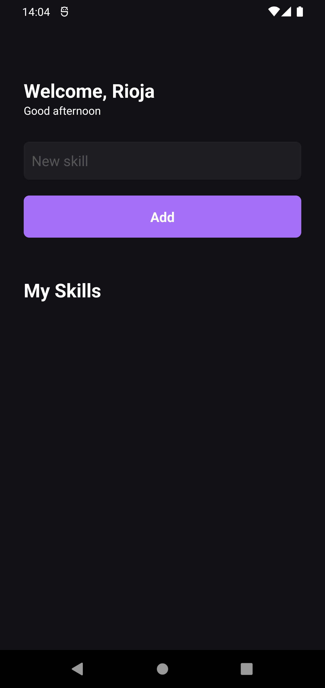
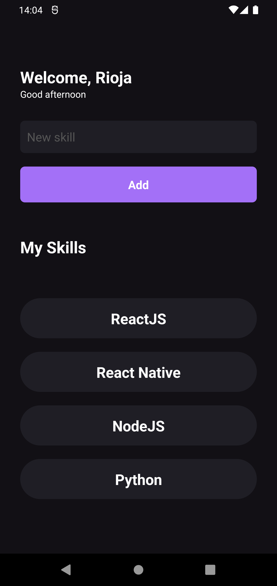

<p align="center">
  
  <br>
</p>
<h3 align="center">
My Skills APP
</h3>

<p align="center">
  
  
  
  
</p>

<p align="center">
  <a href="#sobre">Sobre</a> •
  <a href="#my-skills">My Skills</a> •
  <a href="#instalação">Instalação</a> •
  <a href="#tecnologias">Tecnologias</a> •
  <a href="#autor">Autor</a>  
</p>

## Sobre

Projeto desenvolvido durante o bootcamp Ignite na trilha de React Native cujo objetivo foi consolidar os fundamentos da tecnologia por meio de conteúdo teórico e prático.

## My Skills

O MySkills é um app para cadastro e acompanhamento de habilidades técnicas e não técnicas desenvolvido em React Native.

O projeto foi desenvolvido durante o primeiro módulo do bootcamp Ignite, da Rocketseat, na trilha de React Native e teve como objetivo mostrar os conceitos básicos da tecnologia através de um projeto enxuto porem prático.

A aplicação é bem simples e possui apenas a tela abaixo, onde estão contidas as funcionalidades do app: cadastro e remoção de habilidades.



Como visto acima, possuímos um campo de texto e um botão.É através dele que adicionamos novas habilidades. Após informar uma nova skill e clicar no botão teremos a seguinte visualização:



Para excluir alguma skill, basta busca-la na lista e clicar sobre ela.
Afim de ilustrar o fluxo do app em sua totalidade, deixo abaixo uma demonstração de uso aonde passo por todas suas funcionalidades:


## Instalação

Antes de começar, você vai precisar ter instalado em sua máquina as seguintes ferramentas:
[Git](https://git-scm.com) e [Node.js](https://nodejs.org/en/). Além disso é bom ter um editor para trabalhar com o código como [VSCode](https://code.visualstudio.com/).

### 📱 Rodando o App (Mobile)

```bash
# Clone este repositório
$ git clone git@github.com:MrRioja/myskills.git

# Acesse a pasta do projeto no terminal/cmd
$ cd myskills

# Instale as dependências
$ npm install
# Caso prefira usar o Yarn execute o comando abaixo
$ yarn

# Execute o bundle
$ npm run start
# Caso prefira usar o Yarn execute o comando abaixo
$ yarn start

# Execute a aplicação em um emulador
$ npm run [ android | ios ]
# Caso prefira usar o Yarn execute o comando abaixo
$ yarn [ android | ios ]

# Após o comando acima o emulador de sua escolha será aberto com a aplicação em execução
```

## Tecnologias

[](https://skillicons.dev)

## Autor

<div align="center">

<h1>Luiz Rioja</h1>
<strong>Backend Developer</strong>
<br/>
<br/>

<a href="https://linkedin.com/in/luizrioja" target="_blank">

</a>

<a href="https://github.com/mrrioja" target="_blank">

</a>

<a href="mailto:lulyrioja@gmail.com?subject=Fala%20Dev" target="_blank">

</a>

<a href="https://api.whatsapp.com/send?phone=5511933572652" target="_blank">

</a>

<a href="https://join.skype.com/invite/tvBbOq03j5Uu" target="_blank">

</a>

<br/>
<br/>
</div>
